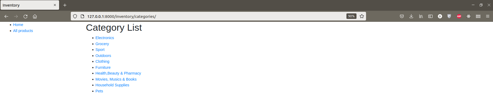

# Inventory

This is a simple CRUD inventory for a logistic company using django framework for back-end.
## Installation

[Optional] Create new virtualenv
- Using pip
```bash
pip3 install virtualenv 
virtualenv -p python3 myenv
source myenv/bin/activate
```
- Using anaconda
```bash
conda create --name myenv python==3.7
conda activate myenv 
```

Use the package manager [pip](https://pip.pypa.io/en/stable/) to install the neccessary frameworks. The version of Python is **3.7**.

```bash
pip install -r requirements.txt
```

## Features

```bash
python3 manage.py runserver
```

Then go to 127.0.0.1:8000/inventory/


### **All basic features of a CRUD app are implemented.**

* **Viewing the current list of products:**


To view the detail of a product in the list, click on the name of the product. You can edit or delete a product from the action column.
Adding a new product option is also available.
```
127.0.0.1:8000/inventory/products
```
* **Viewing the detail of a product:**


```
127.0.0.1:8000/inventory/product/<uuid:product_id>
```
* **Adding a new product:**
  
There is a button to add new product at the end of the products table

```
127.0.0.1:8000/inventory/products/create
```


* **Editting a product:**

From the products list, click on the product that you want to edit.

```
127.0.0.1:8000/inventory/product/<uuid:product_id>/edit
```


* **Deleting a product:**

From the products list, click on the product that you want to delete.

```
127.0.0.1:8000/inventory/product/<uuid:product_id>/delete
```


* **Additionally, the list of available categories can be viewed from the products list page:**

```
127.0.0.1:8000/inventory/categories
```


### **More features**
* **Exporting the current list of products to csv file:**
  
To download the current list of products as `csv` file, you can go to the products list (127.0.0.1:8000/inventory/products), click on the `Export` button at the end of the table. The default name for the file is `table.csv`. A message box will be prompt to confirm the choice when clicking the `Export` button.


### **Upcoming features**
* Allow image uploads AND store image with generated thumbnails
* When deleting, allow deletion comments and undeletion
* Filtering based on fields/inventory count/tags/other metadata
* Ability to assign/remove inventory items to a named group/collection
* Ability to create warehouses/locations and assign inventory to specific locations
* Ability to create “shipments” and assign inventory to the shipment, and adjust inventory appropriately
* Ability to generate a report on inventory levels over time, like: most in-stock or out-of-stock last month

## Data Model (Updating)


## Contributing
Pull requests are welcome. For major changes, please open an issue first to discuss what you would like to change.

Please make sure to update tests as appropriate.